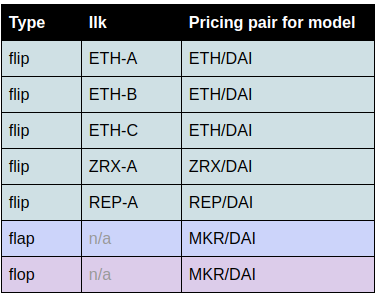

# auction-keeper

[](https://travis-ci.org/makerdao/auction-keeper)
[](https://codecov.io/gh/makerdao/auction-keeper)

The _DAI Stablecoin System_ incentivizes external agents, called _keepers_, to automate certain operations around the 
Ethereum blockchain.  The purpose of `auction-keeper` is to:
 * Seek out opportunities and start new auctions
 * Detect auctions started by other participants
 * Bid on auctions by converting token prices into bids

Check out the <a href="https://youtu.be/wevzK3ADEjo?t=733">July 23rd, 2019 community meeting</a> 
for some more information about MCD auctions and the purpose of this component.

`auction-keeper` can participate in `flip` (collateral sale), `flap` (MKR buy-and-burn)
and `flop` (MKR minting) auctions. Its unique feature is the ability to plug in external
_bidding models_, which tell the keeper when and how high to bid. This keeper can be safely
left running in background. The moment it notices or starts a new auction it will spawn a new instance
of a _bidding model_ for it and then act according to its instructions. _Bidding models_ will
be automatically terminated by the keeper the moment the auction expires.  The keeper also
automatically `deal`s expired auctions if it's us who won them.

This keeper is intended to be a reference implementation.  It may be used as-is, or pieces borrowed to 
develop your own auction trading bot.

<https://chat.makerdao.com/channel/keeper>


## Architecture

`auction-keeper` directly interacts with `Flipper`, `Flapper` and `Flopper` auction contracts
deployed to the Ethereum blockchain. Decisions which involve pricing are delegated to _bidding models_.

_Bidding models_ are simple processes, external to the main `auction-keeper` process. As they do not have to know
anything about blockchain and smart contracts, they can be implemented in basically any programming language.
The only thing they need to do is to read and write JSON documents they exchange with `auction-keeper`. The simplest 
example of a bidding model is a shell script which echoes a fixed price.


### Monitoring ongoing auctions and discovering new ones

The main task of this keeper, as already outlined above, is to constantly monitor all ongoing auctions,
discover new ones, ensure that an instance of _bidding model_ is running for each auction, provide
these instances of the current status of their auctions and bid according to decisions taken by them.

The way the auction discovery and monitoring mechanism works at the moment is simplistic for illustration purposes. 
It basically operates as a loop which kicks in on every new block enumerating all auctions from `1` to `kicks`.
Bidding models are checked every 2 seconds and submitted where appropriate.


### Starting and stopping _bidding models_

`auction-keeper` maintains a collection of child processes, as each _bidding model_ is its own dedicated
process. New processes (new _bidding model_ instances) are spawned by executing a command according to the
`--model` commandline parameter. These processes are automatically terminated (via `SIGKILL`) by the keeper
shortly after their associated auction expires.

Whenever the _bidding model_ process dies, it gets automatically respawned by the keeper.

Example:
```bash
bin/auction-keeper --model '../my-bidding-model.sh' [...]
```


### Communicating with _bidding models_

`auction-keeper` communicates with _bidding models_ via their standard input and standard output.

Straight away after the process gets started, and every time the auction state changes, the keeper
sends a one-line JSON document to the **standard input** of the _bidding model_ process.
Sample message sent from the keeper to the model looks like:
```json
{"id": "6", "flapper": "0xf0afc3108bb8f196cf8d076c8c4877a4c53d4e7c", "bid": "7.142857142857142857", "lot": "10000.000000000000000000", "beg": "1.050000000000000000", "guy": "0x00531a10c4fbd906313768d277585292aa7c923a", "era": 1530530620, "tic": 1530541420, "end": 1531135256, "price": "1400.000000000000000028"}
```

The meaning of individual fields:
* `id` - auction identifier.
* `flipper` - Ethereum address of the `Flipper` contract (only for `flip` auctions).
* `flapper` - Ethereum address of the `Flapper` contract (only for `flap` auctions).
* `flopper` - Ethereum address of the `Flopper` contract (only for `flop` auctions).
* `bid` - current highest bid (will go up for `flip` and `flap` auctions).
* `lot` - amount being currently auctioned (will go down for `flip` and `flop` auctions).
* `tab` - bid value which will cause the auction to enter the `dent` phase (only for `flip` auctions).
* `beg` - minimum price increment (`1.05` means minimum 5% price increment).
* `guy` - Ethereum address of the current highest bidder.
* `era` - current time (in seconds since the UNIX epoch).
* `tic` - time when the current bid will expire (`null` if no bids yet).
* `end` - time when the entire auction will expire.
* `price` - current price being tendered (can be `null` if price is infinity).

_Bidding models_ should never make an assumption that messages will be sent only when auction state changes.
It is perfectly fine for the `auction-keeper` to periodically send the same messages to _bidding models_.

At the same time, the `auction-keeper` reads one-line messages from the **standard output** of the _bidding model_
process and tries to parse them as JSON documents. Then it extracts two fields from that document:
* `price` - the maximum (for `flip` and `flop` auctions) or the minimum (for `flap` auctions) price
  the model is willing to bid.
* `gasPrice` (optional) - gas price in Wei to use when sending the bid.

A sample message sent from the model to the keeper may look like:
```json
{"price": "750.0", "gasPrice": 7000000000}
```

Whenever the keeper and the model communicate in terms of prices, it is the MKR/DAI price (for `flap`
and `flop` auctions) or the collateral price expressed in DAI e.g. DGX/DAI (for `flip` auctions).

Any messages writen by a _bidding model_ to **stderr** will be passed through by the keeper to its logs.
This is the most convenient way of implementing logging from _bidding models_.


### Simplest possible _bidding model_

If you just want to bid a fixed price for each auction, this is the simplest possible _bidding model_
you can use:

```bash
#!/usr/bin/env bash

echo "{\"price\": \"750.0\"}"  # put your price here
sleep 60
```

The stdout provides a price for the collateral (for `flip` auctions) or MKR (for `flap` and `flop` auctions).  The 
sleep locks the price in place for a minute, after which the keeper will restart the price model and read a new price.  
Consider this your price update interval.


## Limitations

* If an auction started before the keeper was started, this keeper will not participate in it until the next block 
is mined.
* This keeper does not explicitly handle global settlement. If global settlement occurs while a winning bid is 
outstanding, the keeper will not request a `yank` to refund the bid.  Workaround is to call `yank` directly using 
`seth`.
* Some keeper functions incur gas fees regardless of whether a bid is submitted.  This includes, but is not limited to, 
the following actions:
  * submitting approvals
  * adjusting the balance of surplus to debt
  * queuing debt for auction
  * biting a CDP or starting a flap or flop auction
* The keeper does not check model prices until an auction exists.  As such, it will `kick`, `flap`, or `flop` in 
response to opportunities regardless of whether or not your Dai or MKR balance is sufficient to participate.  This too 
imposes a gas fee.
* After procuring more Dai, the keeper must be restarted to add it to the Vat.


## Installation

This project uses *Python 3.6.6*.

In order to clone the project and install required third-party packages please execute:
```
git clone https://github.com/makerdao/auction-keeper.git
cd auction-keeper
git submodule update --init --recursive
pip3 install -r requirements.txt
```

For some known Ubuntu and macOS issues see the [pymaker](https://github.com/makerdao/pymaker) README.


## Usage

```
usage: auction-keeper [-h] [--rpc-host RPC_HOST] [--rpc-port RPC_PORT]
                      [--rpc-timeout RPC_TIMEOUT] --eth-from ETH_FROM
                      [--eth-key [ETH_KEY [ETH_KEY ...]]] --addresses
                      ADDRESSES [--type {flip,flap,flop}] [--ilk ILK]
                      [--bid-only] [--vat-dai-target VAT_DAI_TARGET]
                      [--keep-dai-in-vat-on-exit] [--keep-gem-in-vat-on-exit]
                      --model MODEL [--debug]

optional arguments:
  -h, --help            show this help message and exit
  --rpc-host RPC_HOST   JSON-RPC host (default: `localhost')
  --rpc-port RPC_PORT   JSON-RPC port (default: `8545')
  --rpc-timeout RPC_TIMEOUT
                        JSON-RPC timeout (in seconds, default: 10)
  --eth-from ETH_FROM   Ethereum account from which to send transactions
  --eth-key [ETH_KEY [ETH_KEY ...]]
                        Ethereum private key(s) to use (e.g.
                        'key_file=aaa.json,pass_file=aaa.pass')
  --network NETWORK     Ethereum network to connect (e.g. 'kovan' or
                        'testnet')
  --type {flip,flap,flop}
                        Auction type in which to participate
  --ilk ILK             Name of the collateral type for a flip keeper (e.g.
                        'ETH-B', 'ZRX-A')
  --bid-only            Do not take opportunities to create new auctions
  --vat-dai-target VAT_DAI_TARGET
                        Amount of Dai to keep in the Vat contract (e.g. 2000)
  --keep-dai-in-vat-on-exit
                        Retain Dai in the Vat on exit, saving gas when
                        restarting the keeper
  --keep-gem-in-vat-on-exit
                        Retain collateral in the Vat on exit
  --model MODEL         Commandline to use in order to start the bidding model
  --debug               Enable debug output
```

To participate in all auctions, a separate keeper must be configured for `flip` of each collateral type, as well as 
one for `flap` and another for `flop`.  Collateral types (`ilk`s) combine the name of the token and a letter 
corresponding to a set of risk parameters.  For example, `ETH-A` and `ETH-B` are two different collateral types for the 
same underlying token (WETH).  



Please note **collateral types in the table above are provided for illustrative purposes, and should not be interpreted 
as an endorsement of which collaterals should be deployed to mainnet**, which will be determined by an appropriate 
governance process.  A complete list of `ilk`s for a deployment may be gleaned from the `addresses.json`.


### Accounting

Auction contracts exclusively interact with Dai (for all auctions) and collateral (for `flip` auctions) in the `Vat`. 
More explicitly:
 * Dai used to bid on auctions is withdrawn from the `Vat`.
 * Collateral and surplus Dai won at auction is placed in the `Vat`.
 
By default, all Dai and collateral in your `eth-from` account is `exit`ed from the Vat and added to your token balance 
when the keeper is shut down.  This feature may be disabled using the `--keep-dai-in-vat-on-exit` and 
`--keep-gem-in-vat-on-exit` switches respectively.  **Using an `eth-from` account with an open CDP is discouraged**, 
as debt will hinder the auction contracts' ability to access your Dai, and `auction-keeper`'s ability to `exit` Dai 
from the `Vat`.

**Using the `eth-from` account on multiple keepers is also discouraged** as it complicates `Vat` inventory management.
When running multiple keepers using the same account, the balance of Dai in the `Vat` will be shared across keepers.  
If using the feature, set `--vat-dai-target` to the same value on each keeper, and sufficiently high to cover total 
desired exposure.

To manually control the amount of Dai in the `Vat`, pass `--keep-dai-in-vat-on-exit` and `--keep-gem-in-vat-on-exit` 
switches, and do not pass the `--vat-dai-target` switch.  You may use [mcd-cli](https://github.com/makerdao/mcd-cli) 
to manually `join`/`exit` Dai to/from each of your keeper accounts.  Here is an example to join 6000 Dai on a testnet, 
and exit 300 Dai on Kovan, respectively:
```bash
mcd -C testnet dai join 6000
mcd -C kovan dai exit 300
```
`mcd-cli` requires installation and configuration; view the 
[mcd-cli README](https://github.com/makerdao/mcd-cli#mcd-command-line-interface) for more information.

MKR used to bid on `flap` auctions is directly withdrawn from your token balance.  MKR won at `flop` auctions is 
directly deposited to your token balance.

 
## Testing

This project uses [pytest](https://docs.pytest.org/en/latest/) for unit testing.  Testing depends upon on a Dockerized 
local testchain included in `lib\pymaker\tests\config`.

In order to be able to run tests, please install development dependencies first by executing:
```
pip3 install -r requirements-dev.txt
```

You can then run all tests with:
```
./test.sh
```


## License

See [COPYING](https://github.com/makerdao/auction-keeper/blob/master/COPYING) file.

### Disclaimer

YOU (MEANING ANY INDIVIDUAL OR ENTITY ACCESSING, USING OR BOTH THE SOFTWARE INCLUDED IN THIS GITHUB REPOSITORY) EXPRESSLY UNDERSTAND AND AGREE THAT YOUR USE OF THE SOFTWARE IS AT YOUR SOLE RISK.
THE SOFTWARE IN THIS GITHUB REPOSITORY IS PROVIDED “AS IS”, WITHOUT WARRANTY OF ANY KIND, EXPRESS OR IMPLIED, INCLUDING BUT NOT LIMITED TO THE WARRANTIES OF MERCHANTABILITY, FITNESS FOR A PARTICULAR PURPOSE AND NONINFRINGEMENT. IN NO EVENT SHALL THE AUTHORS OR COPYRIGHT HOLDERS BE LIABLE FOR ANY CLAIM, DAMAGES OR OTHER LIABILITY, WHETHER IN AN ACTION OF CONTRACT, TORT OR OTHERWISE, ARISING FROM, OUT OF OR IN CONNECTION WITH THE SOFTWARE OR THE USE OR OTHER DEALINGS IN THE SOFTWARE.
YOU RELEASE AUTHORS OR COPYRIGHT HOLDERS FROM ALL LIABILITY FOR YOU HAVING ACQUIRED OR NOT ACQUIRED CONTENT IN THIS GITHUB REPOSITORY. THE AUTHORS OR COPYRIGHT HOLDERS MAKE NO REPRESENTATIONS CONCERNING ANY CONTENT CONTAINED IN OR ACCESSED THROUGH THE SERVICE, AND THE AUTHORS OR COPYRIGHT HOLDERS WILL NOT BE RESPONSIBLE OR LIABLE FOR THE ACCURACY, COPYRIGHT COMPLIANCE, LEGALITY OR DECENCY OF MATERIAL CONTAINED IN OR ACCESSED THROUGH THIS GITHUB REPOSITORY. 
